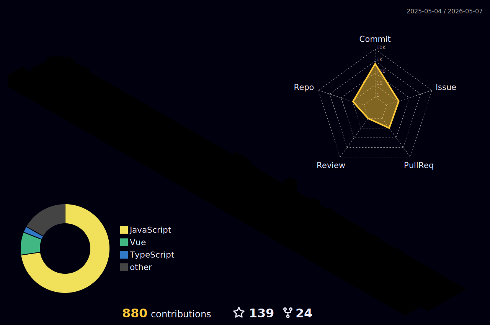

A front-end enthusiast and learner.

<a href="https://zhenghaoyang.cn" target="_blank">🔗 blog</a> • [📧 email](mailto:zhenghaoyang24@foxmail.com)   

### Tech stack

### Tools I use

### Some projects

- 📘 [english-vocabulary](https://github.com/zhenghaoyang24/english-vocabulary): 10万+单词，20万+例句。 / 100,000+ words, 200,000+ example sentences.  
- 📱 [inputword](https://github.com/zhenghaoyang24/inputword): 以精简与实用为出发点的单词记忆小程序。 / A minimalist and practical vocabulary memorization mini-program.
- 🧠 [vocabverse](https://github.com/zhenghaoyang24/vocabverse)：基于SM2算法的单词记忆 Web 应用。 / Complete vocabulary memorization web application.
- 📱 [blueblue-words](https://github.com/zhenghaoyang24/blueblue-words)：简易记单词小程序。 / A simple vocabulary memorization mini-program.
- ☑️ [you-todo](https://github.com/zhenghaoyang24/you-todo)：简洁易用的日程待办 Web 应用。 / A clean and user-friendly schedule and to-do web app.
- ℹ️ [Front-Resource](https://github.com/zhenghaoyang24/Front-Resource)：收集前端开发的各类资源。 / Various resources for front-end development .
- 🎮 [webgames](https://github.com/zhenghaoyang24/webgames)：各种打开即可游玩的小游戏。 / Ready-to-play mini games of various types.
- 🏠 [reposhub](https://github.com/zhenghaoyang24/reposhub)：开源仓库集合，分类仓库。 / Open-source repository collection, categorized repositories.
- ✒️ [mdeditor](https://github.com/zhenghaoyang24/mdeditor)：极简的 markdown 在线编辑器。 / A minimalist online Markdown editor.

