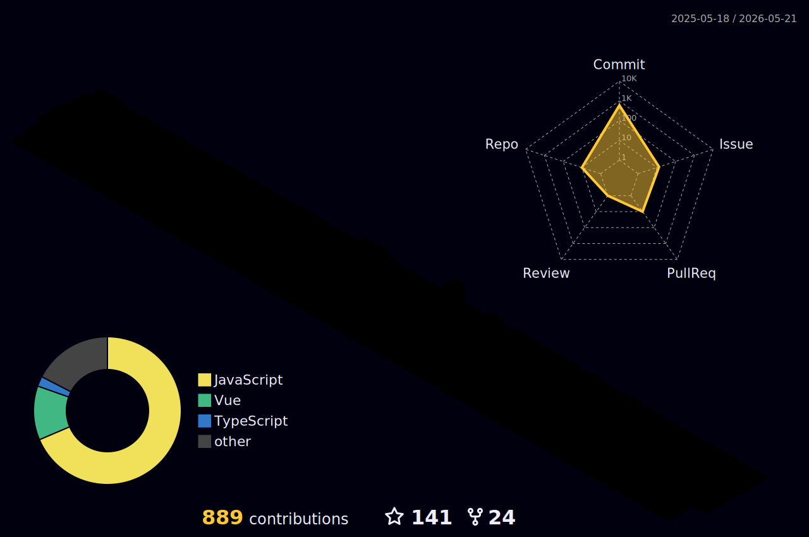

A front-end enthusiast and learner.

<a href="https://zhenghaoyang.cn" target="_blank">🔗 blog</a> • [📧 email](mailto:zhenghaoyang24@foxmail.com)   

### Tech stack

### Tools I use

### Some projects

- 💻 [cli-home](https://github.com/zhenghaoyang24/cli-home)：一个还算好看的终端式浏览器主页。/A fairly decent terminal-based browser homepage.
- 📘 [english-vocabulary](https://github.com/zhenghaoyang24/english-vocabulary): 10万+单词，20万+例句。 / 100,000+ words, 200,000+ example sentences.  
- 📱 [inputword](https://github.com/zhenghaoyang24/inputword): 带服务端的单词记忆小程序。 / Word Memory Mini Program with Server Side.
- 🧠 [vocabverse](https://github.com/zhenghaoyang24/vocabverse)：基于SM2算法的单词记忆 Web 应用。 / Complete vocabulary memorization web application.
- ☑️ [you-todo](https://github.com/zhenghaoyang24/you-todo)：简洁易用的日程待办 Web 应用。 / A clean and user-friendly schedule and to-do web app.
- 🌲 [filetree](https://github.com/zhenghaoyang24/filetree): 根据本地文件夹生成文件树，导出文件结构。 / Generate a file tree from local files and export the file structure.
